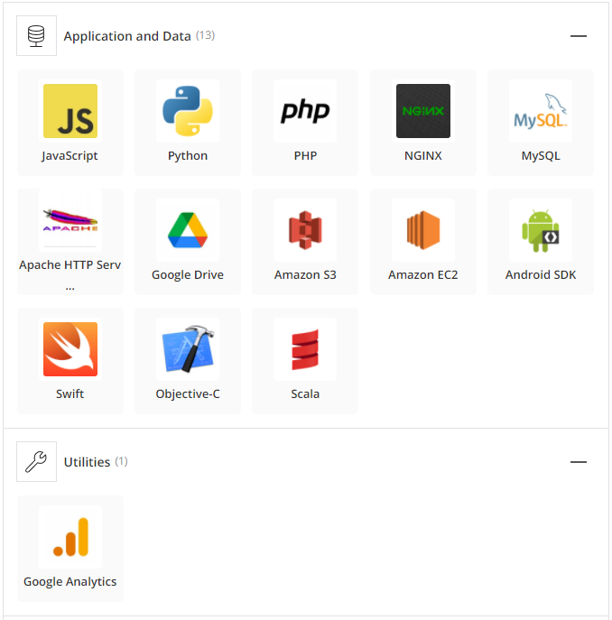

# Unit 1 Homework Assignment: FinTech Case Study

 

# Credit Karma - Championing financial progress for all 

## Overview and Origin

The focus of my case study will be Credit Karma. The idea for the company was started in 2007 by Kenneth Lin and cofounders Nichole Mustard and Ryan Graciano. It was incorporated on March 8, 2007, but the initial webpage did not go public until September of that year. The idea was started by Kenneth Lin who had previously worked in the credit card industry. He believed that the average consumer has a right to know their credit score so that they may have the necessary information when making important financial decisions. Years ago Mr. Lin did an interview with a Christian blog website where he stated, "I tried a credit monitoring service and couldn’t understand why it was so expensive to monitor my own score. I mean it was my score, why should I have to pay so much for it?" 

With this in mind Mr. Lin decided to start a company that would offer people the ability to check their credit scores for free. As the years went by he and his team added a number of other useful applications and services to their credit karma product, all in the name of helping the everyday man achieve financial control over his own future. Credit Karma's initial funding of $2.5 million was acquired through venture capital firms such as SV Angel and Founders Fund. The company is predicated on the idea of helping the everyday man therefore the product offered is completely free. The company makes its money through referral fees from banks and other financial institutions that benefit from their consumer base.

## Business Activities

Credit Karma's main goal when entering the credit industry was to ensure that customers were not being charged for their own credit information. People should have a right to their own information especially if said inforamtion can make a world of difference when it comes to financial decison making. The company hopes to help its users though autonomous finance i.e. making financial goals and using the technology to manage spending habits to achieve those goals. Due to this it has become increasingly popular among Generation Z and Millenials. Currently the company has over 100 million users over 3 countries. Generation Z and Millenials account for over 75% of the user base. 

* What solution does this company offer that their competitors do not or cannot offer? (What is the unfair advantage they utilize?)

* Which technologies are they currently using, and how are they implementing them? (This may take a little bit of sleuthing–– you may want to search the company’s engineering blog or use sites like Stackshare to find this information.)

## Landscape:

* What domain of the financial industry is the company in?

* What have been the major trends and innovations of this domain over the last 5-10 years?

* What are the other major companies in this domain?

## Results

* What has been the business impact of this company so far?

* What are some of the core metrics that companies in this domain use to measure success? How is your company performing, based on these metrics?

* How is your company performing relative to competitors in the same domain?

## Recommendations

* If you were to advise the company, what products or services would you suggest they offer? (This could be something that a competitor offers, or use your imagination!)

* Why do you think that offering this product or service would benefit the company?

* What technologies would this additional product or service utilize?

* Why are these technologies appropriate for your solution?

----

# Addendum 

## Overiew and Origin 
* https://www.creditkarma.com/ourstory
* https://web.archive.org/web/20151212234750/http://www.forbes.com/sites/laurengensler/2015/12/09/credit-karma-cracking-the-credit-cartel/
* https://christianfinanceblog.com/2009/03/27/interview-with-credit-karma-ceo-ken-lin/ 
* https://techcrunch.com/2009/11/04/credit-karma-raises-2-5-million-to-take-the-mystery-out-of-credit-scores/
* https://www.crunchbase.com/organization/credit-karma/company_financials

## Business Activities 
* https://review.firstround.com/credit-karmas-ceo-built-a-sexy-brand-in-an-unsexy-category-with-no-pr-firm-and-a-tiny-budget-heres-how
* https://www.pymnts.com/personal-finance/2021/credit-karma-good-habits-will-pave-the-way-to-autonomous-finance
* https://www.crunchbase.com/organization/credit-karma/technology

